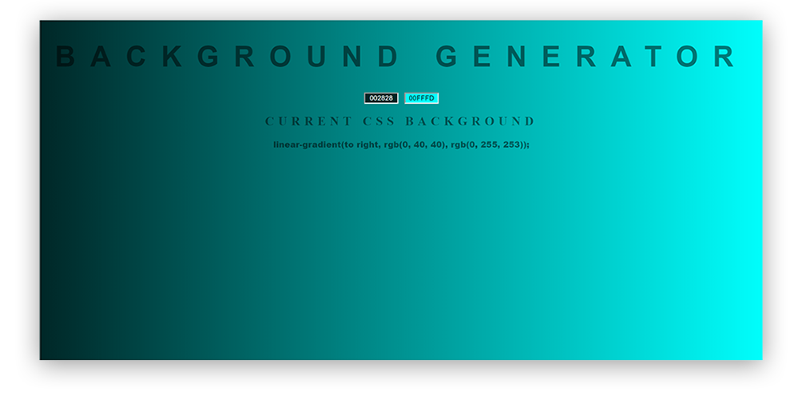

<h1 align="center">Gradient Background Generator</h1>

&nbsp;&nbsp;&nbsp;&nbsp;&nbsp;&nbsp;&nbsp;&nbsp;&nbsp;&nbsp;&nbsp;&nbsp;&nbsp;&nbsp;&nbsp;&nbsp;&nbsp;&nbsp;&nbsp;&nbsp;&nbsp;&nbsp;&nbsp;&nbsp;&nbsp;&nbsp;&nbsp;&nbsp;&nbsp;&nbsp;&nbsp;&nbsp;&nbsp;&nbsp;&nbsp;&nbsp;&nbsp;&nbsp;&nbsp;&nbsp;&nbsp;&nbsp;&nbsp;&nbsp;&nbsp;&nbsp;&nbsp;&nbsp;&nbsp;

---

This was just something I created for fun. It lets you select a gradient background by specifying two colors individually. This is achieved by clicking on the textboxes, which then displays a color picker which lets you select a color which keeps updating in realtime as you are tinkering with the picker. This is achieved through the jscolor library with some alterations. On MAC systems the default color picker would update the background in realtime, however in windows it wasn't the case. Therefore I had to use the jscolor library and change it to work with the project.

It has been deployed on GitHub Pages so that you can take it for a spin by clicking on the "Demo" link below. The project is pushed onto the gh-pages branch allowing the static website to be opened and viewed.

Try it out: 
## [DEMO](https://iamdylan.github.io/Gradient_Background_Generator/)

 

#### SCREENSHOT:

Tools used:
+ HTML
+ CSS
+ JavaScript
+ jsColor
+ Git
+ Sublime
+ Cmder
+ GitHub Pages
+ Photoshop (for the images above).

Please let me know of any suggestions or corrections you would like me to be aware of.
